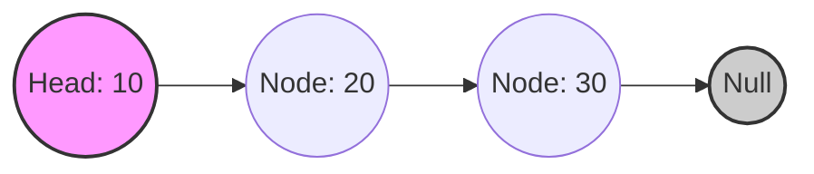
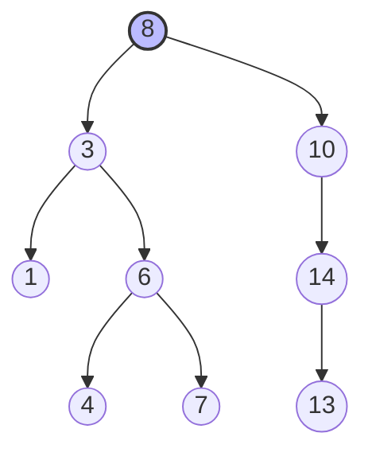

#  Master Data Structures & Algorithms in C++

  

## 🚀 About This Repository
This repository contains my personal journey, practice materials, and solutions for **Data Structures and Algorithms** using **C++**. 
The goal is to deeply understand how data is organized, stored, and manipulated to write highly efficient software.

---

## 🧠 Core Data Structures
A **Data Structure** is a specialized format for organizing, processing, retrieving and storing data. Here are the core structures we explore:

<b>1. Arrays & Vectors</b>

 
Contiguous blocks of memory holding elements of the same type. Fast access, but slower insertions and deletions in the middle.

<b>2. Linked Lists</b>

 
Nodes connected by pointers. They do not require contiguous memory, making insertions and deletions very fast, though random access is slower.

<b>3. Trees & Binary Search Trees (BST)</b>

 
Hierarchical data structures with a root node and children. Extremely powerful for fast lookups and hierarchical data mapping.

---

## ⚡ Essential Algorithms
An **Algorithm** is a step-by-step procedure for solving a problem or performing a computation.

### 🔄 Sorting Algorithms
- **Merge Sort**: A divide-and-conquer algorithm that divides the array into halves, recursively sorts them, and merges them. `Time: O(N log N)`
- **Quick Sort**: Picks a pivot and partitions the array around the pivot. `Time: O(N log N) average`
- **Bubble / Selection / Insertion Sort**: Fundamental sorting algorithms primarily used for educational purposes due to their `O(N²)` time complexities.

### 🔍 Searching Algorithms
- **Linear Search**: Checks every element sequentially from the start to the end. `Time: O(N)`
- **Binary Search**: Efficiently searches a **sorted array** by repeatedly dividing the search interval in half. `Time: O(log N)`

---

## 📂 Repository Organization Strategy
This repository strictly follows an isolated branching strategy to keep learning modules completely independent:
* `linear-only`: Contains solely the code for Linear and Binary searches.
* `functions-only`: Contains solely the C++ Functions and Pointers practice.
* `topic/sorting-algorithms`: Contains various sorting algorithms like Merge Sort.

---

## 🎯 Progress Tracker
- [x] C++ Basics and Vectors
- [x] Functions and Pointers
- [x] Linear & Binary Search
- [x] Merge Sort Algorithm
- [ ] Recursion Deep Dive
- [ ] Object-Oriented Programming (OOP)
- [ ] Linked Lists Implementation
- [ ] Graphs and Dynamic Programming

 

  &nbsp;
  

<i>Happy Coding!</i>

